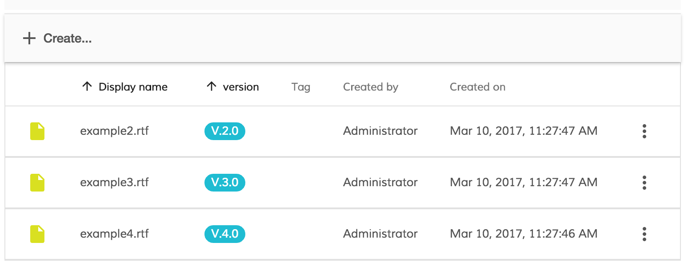

# Customize Document list

The examples in this repository are part of the [slides](https://www.slideshare.net/EugenioRomano/adf-in-action-12) adf in action.
In this Example we are going to customize the ADF document list in order to show the version of the file.

<p align="center">
  </img>
</p>


```html


        <!-- Example 1 using custom column template show version file -->
        <content-column title="version" key="name" sortable="true" class="full-width ellipsis-cell">
             <template let-context="$implicit">
                      <div>V.{{context.row.getValue('properties.cm:versionLabel')}}</div>
            </template>
        </content-column>

        <!-- Example 2 using custom column template show version file if present -->
        <content-column title="version" key="name" sortable="true" class="full-width ellipsis-cell">
             <template let-context="$implicit">
               <div  *ngIf="context.row.getValue('properties.cm:versionLabel')">
                 V.{{context.row.getValue('properties.cm:versionLabel')}}
               </div>
            </template>
        </content-column>

        <!-- Example 3 using custom column template show version file with style -->
        <content-column title="version" key="name" sortable="true" class="full-width ellipsis-cell">
             <template let-context="$implicit">
                      <div  *ngIf="context.row.getValue('properties.cm:versionLabel')" class="version-style">
                        V.{{context.row.getValue('properties.cm:versionLabel')}}
                      </div>
            </template>
        </content-column>

        <!-- Example 4 using a component -->
        <content-column title="version" key="name" sortable="true" class="full-width ellipsis-cell">
             <template let-context="$implicit">
               <ng2-alfresco-version-badge [version]="context.row.getValue('properties.cm:versionLabel')"></ng2-alfresco-version-badge>
            </template>
        </content-column>

        <!-- Example 5 using a component and change the stle-->
        <content-column title="version" key="name" sortable="true" class="full-width ellipsis-cell">
             <template let-context="$implicit">
               <ng2-alfresco-version-badge [version]="context.row.getValue('properties.cm:versionLabel')"></ng2-alfresco-version-badge>
            </template>
        </content-column>


```

The example 5 use the [Version Badge Component](../ng2-alfresco-version-badge/README.md)

## Prerequisites

Before you start using this development framework, make sure you have installed all required software and done all the
necessary configuration, see this [page](https://github.com/Alfresco/alfresco-ng2-components/blob/master/PREREQUISITES.md).

## Building and Running

Install dependencies

```sh
npm install
```

### Development build

```sh
npm start
```

This command compiles and starts the project in watch mode.
Browser will automatically reload upon changes.
Upon start you can navigate to `http://localhost:3000` with your preferred browser.

#### Important notes

This script is recommended for development environment and not suited for headless servers and network access.

### Production build

```sh
npm run build
npm run start:dist
```

This command builds project in `production` mode.
All output is placed to `dist` folder and can be served your preferred web server.
You should need no additional files outside the `dist` folder.

#### Important notes

By default demo application is configured to use [wsrv](https://www.npmjs.com/package/wsrv) tool (lightweight web server)
to serve production build output. It will be running at `0.0.0.0` address with port `3000` and allow you accessing your application
via network. However you can use any web server of your choice in production.

## i18n support

To support a new language you need to create your language file (.json) and add it to `i18n/` folder.

```json
{
        "username" : "Username",
        "input-required-message": "Required",
        "input-min-message": "Your username needs to be at least 4 characters.",
        "login-button": "Login"
}
```

Directory structure:
```
.
├── custom-translation/
│   ├──i18n/
│      ├──
│      ├── en.json
│      ├── it.json
│      └── fr.json
```

## Custom-files

If you need to add custom files on your project you can add this files in the folders public

```
.
├── public/
│   ├── images/
│   ├── css/
│   └── js/
```

the public folder above wil be copied in the root of your project and you can refer to them for example as

 * './images/custom_image.png'
 * './js/custom_script.js'
 * './css/custom_style.css'


## History

For detailed changelog, check [Releases](https://github.com/eromano/customize-document-list/releases).

## Contributors

[Contributors](https://github.com/eromano/customize-document-list/graphs/contributors)

